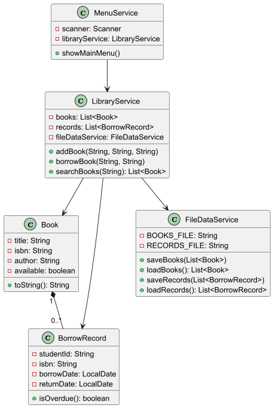

# 图书管理系统设计文档

## 1. 系统功能
- 图书信息管理（书名、ISBN、作者、在库状态）
- 借阅系统（学生卡号、借书日期、归还日期）
- 搜索功能（按书名/作者模糊搜索）
- 逾期检测（超过30天未归还预警）
- 数据持久化（文本文件存储）

## 2. UML类图

## 3. 设计模式
- 单例模式：FileDataService
- MVC模式：MenuService(View), LibraryService(Controller), Book/Record(Model)